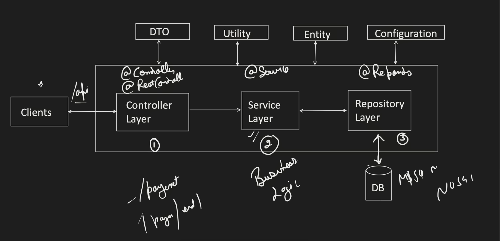

# Spring Boot Core


## Step 1 : Setup a spring project → https://start.spring.io/

## Spring Boot Architecture




- DTO - Data Transfer Object (deals with request body content)
- Entity - Simple POJO classes with **@entity** which represents the table in DB
- Configuration - All config info like db_name, password etc.

---

# Dependency Injection

Main Idea → A class should ask **what it needs**, **not create** anything by itself.

When a class is dependent on a object of another class, instead of creating the object inside the class itself, only initialise the instance variable and pass the object through **constructor injection** or **Setter Injection**. This is known as dependency injection.

```java
public class OrderService {

	NotificationService notificationService;
	
	public OrderService(NotificationService notificationService) {
		this.notificationService = notificationService;
	}
	
	public void placeOrder() {
		System.out.print("Order has been placed");
		notificationService.sendNotification();
	}
	
}
```

## Benefits of DI

- System becomes Loosely Coupled.
- Unit testing becomes more easier.
- Easy to maintain.
- Follows Single Responsibility and Open/Closed principles.

# Inversion Of Control (IOC)

- **IoC** means **Spring controls the creation and management of objects (beans)** instead of the programmer.

### Without IoC

```java
Engine engine = new Engine();
Car car = new Car(engine);
```

- Programmer creates objects using `new`.

### With IoC

```java
@Component
class Engine {}

@Component
class Car {
    public Car(Engine engine) {}
}
```

- Spring creates `Engine`.
- Spring creates `Car`.
- Spring injects `Engine` into `Car`.

### IoC Container

The **IoC Container** is responsible for:

- Creating beans
- Managing beans
- Injecting dependencies (DI)
- Managing bean lifecycle

### IoC vs DI

| IoC | DI |
| --- | --- |
| **Who creates objects?** → Spring | **How are dependencies provided?** → Injection |
| Design principle | Technique used by Spring |

# How to use IoC Container in Maven?

1. Add [**Spring-Context**](https://mvnrepository.com/artifact/org.springframework/spring-context) dependency in **pom.xml**
    
    ```xml
    <dependencies>
            <dependency>
                <groupId>org.springframework</groupId>
                <artifactId>spring-context</artifactId>
                <version>7.0.7</version>
                <scope>compile</scope>
            </dependency>
    </dependencies>
    ```
    
2. There are **2 ways** to use Spring IoC Container
    1. **Annotation Configuration** Based (modern)
        
        To tell spring which classes to manage use **@Component** Annotation
        
        ```java
        @Component
        public class PaymentService {
            public void pay() {
                System.out.println("Payment done");
            }
        }
        ```
        
    2. **XML Configuration** Based (most of legacy code has this)
    
    This Annotation Config Based
    
3. To **initialise Spring IoC container** we use **ApplicationContext**
    
    ```java
    ApplicationContext context = new AnnotationConfigApplicationContext();
    ```
    


# Spring Context Annotations

1. `@Component` → It is used to **mark a class as a Spring bean** so that Spring automatically detects, creates, and manages it in the IoC container.
    
    ### Limitation of `@Component`
    
    - **You can only use `@Component` on classes whose source code you can modify.**
    - `@Bean` inside a `@Configuration` class should be used instead.
    
2. `@Configuration` → It marks a class as a source of **Spring bean definitions** (configuration class).
3. `@ComponentScan` → It tells Spring to scan specified packages for components (`@Component`, `@Service`, `@Repository`, `@Controller`) and register them as beans.
4. `@Autowired` → It tells Spring to automatically **inject the required dependency** into a bean.
5. `@Primary` **→** It marks a bean as the **default choice** when multiple beans of the same type are available for injection.
    
    ```java
    @Component
    @Primary
    class PetrolEngine implements Engine {}
    
    @Component
    class DieselEngine implements Engine {}
    ```
    
6. `@Qualifier` **→** It specifies **exactly which bean** should be injected when multiple beans of the same type exist.
    
    ```java
    @Autowired
    @Qualifier("dieselEngine")
    private Engine engine;
    ```
    
    - **`@Primary`** → Default bean.
    - **`@Qualifier`** → Specific bean by name.
7. `@Bean` → It is used inside a `@Configuration` class to manually create and register an object as a Spring bean in the IoC container.
    
    ```java
    @Configuration
    public class AppConfig {
    
        @Bean
        public User user() {
            return new User("Adwait", 21);
        }
    }
    ```
    

# Circular Dependency

**A circular dependency occurs when two beans depend on each other.**

### Example

```
Class A → depends on B
Class B → depends on A
```

```java
class A {
    A(B b) {}
}

class B {
    B(A a) {}
}
```

**Problem:** Spring cannot decide which bean to create first, resulting in a **Circular Dependency** error.

**IMP : Code should not contain any circular dependency, it’s a bad practice to have circular dependency.**

## Ways to Resolve Circular Dependency

1. **Redesign the classes (Recommended)** – Remove the circular dependency.
2. **Use Setter Injection** – Allows Spring to create objects first, then inject dependencies.
3. **Use `@Lazy`** – Delays the creation of one bean until it is actually needed.

### Example using `@Lazy`

```java
@Component
class A {
    A(@Lazy B b) {}
}
```

# Bean Scopes

Bean Scope defines **how many instances** of a bean Spring creates and how long they live.

### 1. Singleton (Default)

- **One bean instance** per Spring IoC container.
- It implement **Eager Initialisation**.

```java
@Scope("singleton")
```

### 2. Prototype

- **New bean instance** every time it is requested.
- It implement **Lazy Initialisation**.

```java
@Scope("prototype")
```

---

### Interview Definition

**Bean Scope defines the lifecycle and the number of instances of a Spring bean managed by the IoC container.**


